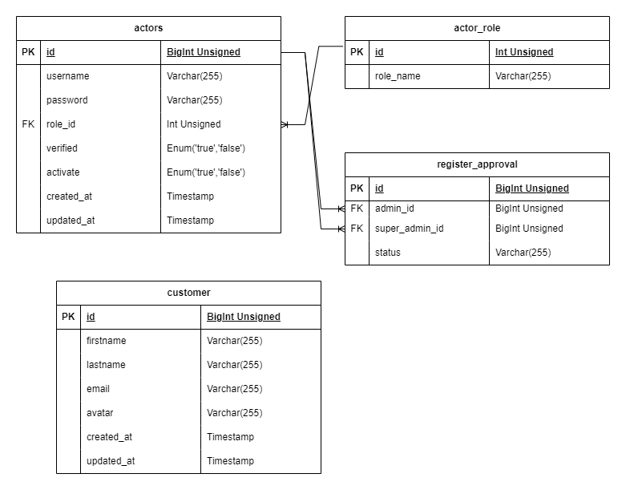

## Run Project with manual

0. Link API postman [postman](https://documenter.getpostman.com/view/16127230/2s93sW9ayD)
1. Dump Sql extension to your mysql database because program disable auto-migrate
2. Build enviroment ```.env```
```
DB_HOST =               // DB HOST
CONNECT_DB =            // your creadentials database
CONNECT_DB_LAST         // your database name
HOUR =                  // string in number to hour
ACCESS_TOKEN_JWT =      // secret-jwt
```
3. Run to download go package 
``` azure
   go mod download 
   go mod tidy
```
4. Run test
```azure
go test ./modules/actor
go test ./modules/customer
```
5. Run program
```azure
go run main.go
```

## Run Project with Docker-compose

1. Run Build Docker-Compose
```azure
docker-compose build
```
2. Run Docker-Compose
```azure
docker-compose up -d
```
## ! Note
you can edit workflows ci/cd in ```.github/workflows/docker.yml```

## API URI
```

 POST   /v1/actor/register        --> crm_service/modules/actor.RequestHandlerActorStruct.CreateActor-fm (10 handlers)
 GET    /v1/actor/:id             --> crm_service/modules/actor.RequestHandlerActorStruct.GetActorById-fm (10 handlers)
 GET    /v1/actor                 --> crm_service/modules/actor.RequestHandlerActorStruct.GetAllActor-fm (10 handlers)
 PUT    /v1/actor/:id             --> crm_service/modules/actor.RequestHandlerActorStruct.UpdateActorById-fm (10 handlers)
 DELETE /v1/actor/:id             --> crm_service/modules/actor.RequestHandlerActorStruct.DeleteActorById-fm (10 handlers)
 GET    /v1/actor/:id/activate    --> crm_service/modules/actor.RequestHandlerActorStruct.ActivateActorById-fm (10 handlers)
 GET    /v1/actor/:id/deactivate  --> crm_service/modules/actor.RequestHandlerActorStruct.DeactivateActorById-fm (10 handlers)
 POST   /v1/actor/login           --> crm_service/modules/actor.RequestHandlerActorStruct.LoginActor-fm (9 handlers)
 GET    /v1/actor/logout          --> crm_service/modules/actor.RequestHandlerActorStruct.LogoutActor-fm (9 handlers)
 POST   /v1/customer/register     --> crm_service/modules/customer.RequestHandlerCustomerStruct.CreateCustomer-fm (10 handlers)
 GET    /v1/customer/:id          --> crm_service/modules/customer.RequestHandlerCustomerStruct.GetCustomerById-fm (11 handlers)
 GET    /v1/customer              --> crm_service/modules/customer.RequestHandlerCustomerStruct.GetAllCustomer-fm (11 handlers)
 PUT    /v1/customer/:id          --> crm_service/modules/customer.RequestHandlerCustomerStruct.UpdateCustomerById-fm (10 handlers)
 DELETE /v1/customer/:id          --> crm_service/modules/customer.RequestHandlerCustomerStruct.DeleteCustomerById-fm (10 handlers)
```
### PRIVILLAGE

```
CREATE USER 'superadmin'@'0.0.0.0' IDENTIFIED BY 'superadmin';
GRANT ALL PRIVILEGES ON crm_service.* TO 'superadmin'@'0.0.0.0';
SHOW GRANTS FOR 'superadmin'@'0.0.0.0';
```

### ERD DATABASES

